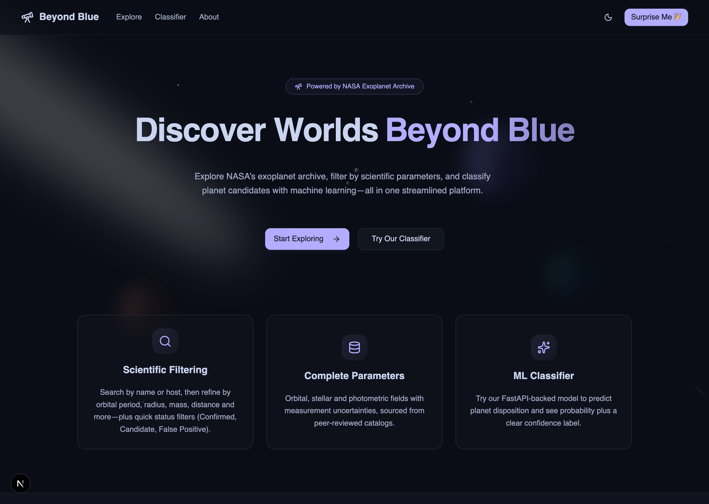
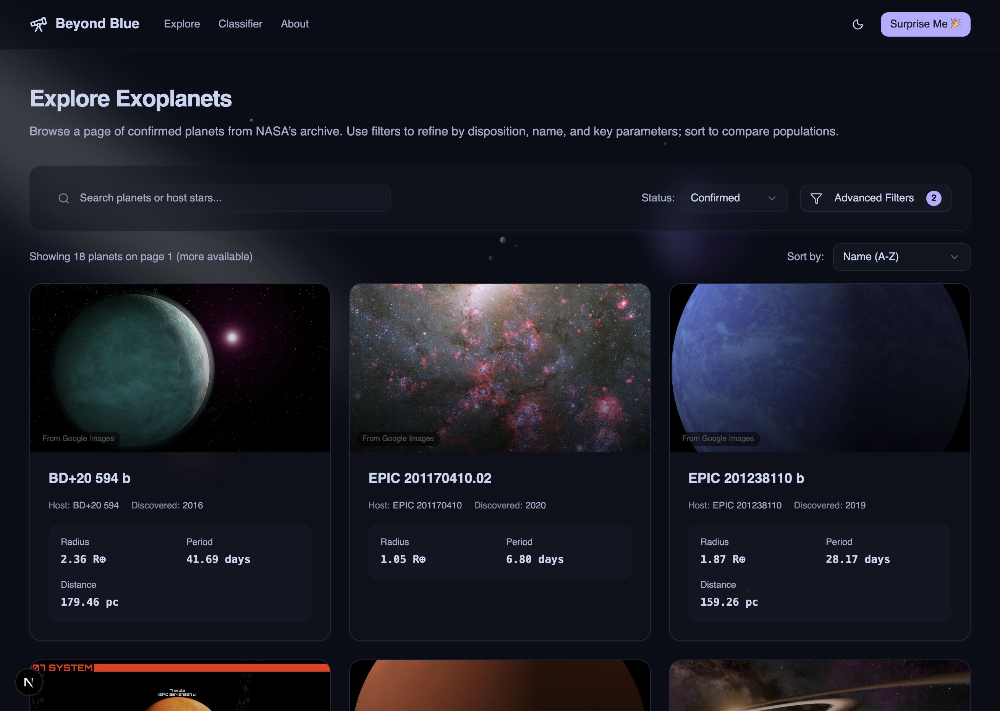
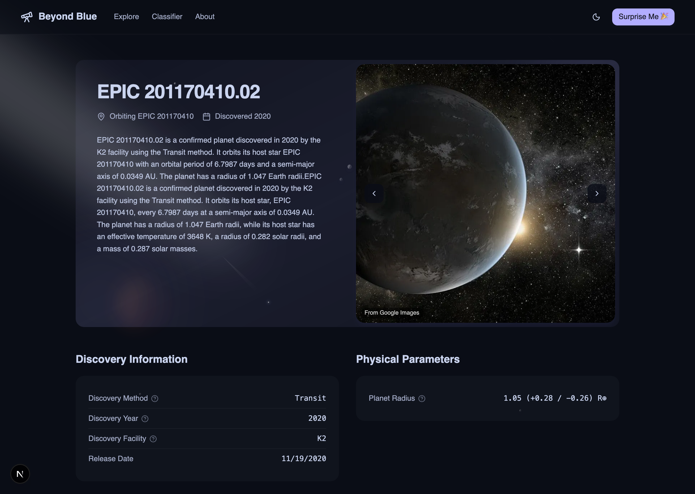
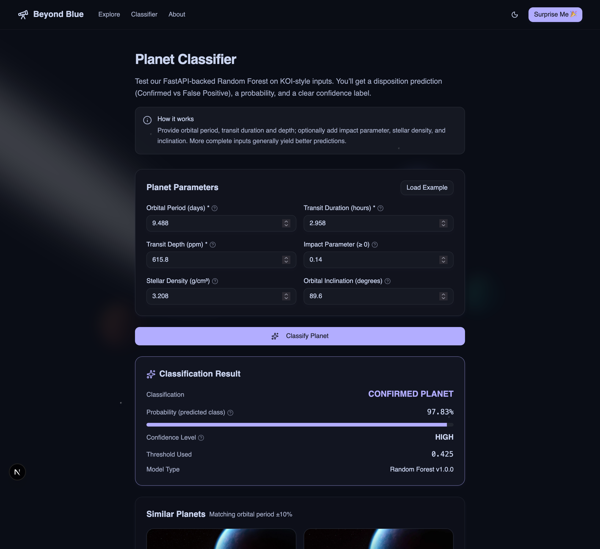
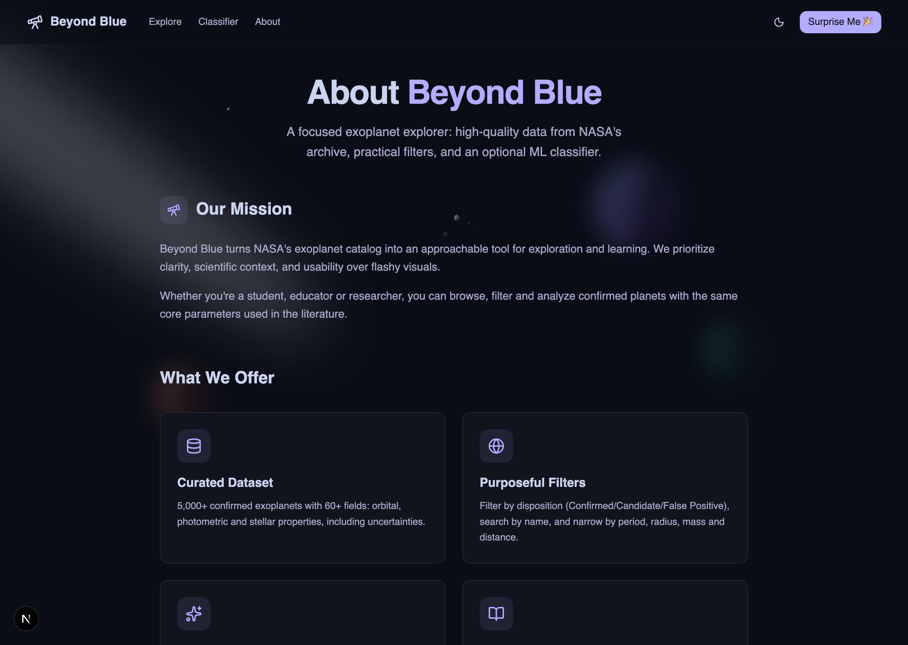

# 🔭 Beyond Blue

An AI-powered platform to explore exoplanets: search and filter NASA exoplanet data, view rich planet profiles, and read AI-generated summaries and stories.

### What this solves

- Discoverability: Surface relevant exoplanets quickly with fast server-side filters and search.
- Comprehension: Turn raw catalog fields into readable, AI-generated planet summaries and story-like overviews.
- Exploration: Compare planets by disposition, discovery year, size, and distance with clean, performant UI.
- Extensibility: Separate services (FastAPI models, Node backend, Next.js UI) make it easy to evolve features independently.

### ML modeling (exoplanet classification)

- We serve a production-ready ML model that predicts whether a candidate is an exoplanet based on features derivable from Earth-based observations.
- The models service is a FastAPI app in `models/` using scikit-learn (Random Forest artifacts live under `models/exo_classification/models/*.joblib`).
- The API accepts physically meaningful features (e.g., orbital period, transit duration and depth, stellar density proxies), and returns a binary prediction with probability and confidence.
- Run the service: `uvicorn models.api.main:app --reload --host 0.0.0.0 --port 8000`. See `models/api/example_usage.py` for request examples.

#### Model performance

Different dataset (out-of-distribution):

| Metric | Value |
|--------|-------|
| Accuracy | 0.6066 |
| Precision (Planet) | 0.4653 |
| Recall (Planet) | 0.5482 |
| F1 (Planet) | 0.5034 |

Validation split (same dataset as training):

| Metric | Value |
|--------|-------|
| Accuracy | 0.8792 |
| Precision (Planet) | 0.7930 |
| Recall (Planet) | 0.9061 |
| F1 (Planet) | 0.8458 |

## Web-Application Preview

Note: Expand the sections to view more screenshots.

<details open>
  <summary><strong>Homepage</strong></summary>

  

</details>

<details>
  <summary><strong>Explore</strong></summary>

  

</details>

<details>
  <summary><strong>Planet Detail</strong></summary>

  

</details>

<details>
  <summary><strong>Classifier</strong></summary>

  

</details>

<details>
  <summary><strong>About</strong></summary>

  

</details>

## Monorepo Structure

```bash
/
├─ models/                 # Python FastAPI service + ML models
│  └─ api/                 # API entrypoints, tests, start scripts
├─ web/
│  ├─ backend/             # Node/Express service for server-side helpers
│  └─ frontend/            # Next.js 15 app (Tailwind, Vitest)
```

### Requirements

- Node.js
- Python ≥ 3.12
- Optional: MongoDB (only if you enable backend Mongo features)

### Quick Start

1) Install dependencies

```bash
# Frontend (Next.js)
cd web/frontend && yarn

# Backend (Express/TypeScript)
cd ../backend && yarn

# Models (FastAPI, via uv or pip)
cd ../../models
# If you use uv (recommended):
uv sync
# or with pip:
pip install -e .
```

2) Configure environment

Create the following files with your local settings:

- Frontend `web/frontend/.env.local`

```bash
NEXT_PUBLIC_API_URL=http://localhost:8000
```

- Backend `web/backend/.env`

```bash
# Required if you use Gemini-powered features
GEMINI_API_KEY=your_key_here
PORT=4000
```

3) Run services (separate terminals)

```bash
# 1) Models API (FastAPI on :8000)
cd models
uvicorn models.api.main:app --reload --host 0.0.0.0 --port 8000

# 2) Backend (Express on :4000)
cd web/backend
yarn dev

# 3) Frontend (Next.js on :3000)
cd web/frontend
yarn dev
```

Open `http://localhost:3000` to use the app.

### Key Scripts

- Frontend
  - `yarn dev` – start Next.js (Turbopack)
  - `yarn build` – build
  - `yarn start` – serve production build
  - `yarn test` – run unit tests (Vitest)

- Backend
  - `yarn dev` – run dev server with ts-node/nodemon
  - `yarn build` – compile TypeScript
  - `yarn start` – run compiled server

- Models
  - FastAPI app entry: `models/api/main.py`
  - Example runner: `models/api/start_api.py`

### API Overview

The frontend integrates with the Models API for planet data and summaries.

Core endpoints (see detailed table in `web/frontend/API_INTEGRATION.md`):

- `GET /ping`
- `GET /planets/:id`
- `GET /confirmed` | `GET /false_positive` | `GET /candidate`
- `GET /search` (supports `pl_name`, `hostname`, `discoverymethod`, `disc_year`, `limit`, `skip`)
- `GET /summary/:id` and `GET /stream-summary/:id`

Configure the frontend to point at your Models API via `NEXT_PUBLIC_API_URL`.

### Development Notes

- UI/UX: The app favors a professional, minimal aesthetic with restrained color usage and clear emphasis on critical actions.
- Frontend stack: Next.js 15, React 19, Tailwind 4, Radix UI, Vitest/RTL.
- Backend stack: Express + TypeScript. Optional integrations (e.g., Gemini) require `GEMINI_API_KEY`.
- Models: FastAPI + scikit-learn. See `models/exo_classification` for artifacts and notebooks.

### Team Members

- Amul Poudel [LinkedIn](https://www.linkedin.com/in/amulpoudel/) | [GitHub](https://github.com/Amul-byte)  
- Binod Dhakal [LinkedIn](https://www.linkedin.com/in/binod-dhakal/) | [GitHub](https://github.com/dhakalbinod)
- Gaurab Thapa Chhetri [LinkedIn](https://www.linkedin.com/in/gaurabchhetri/) | [GitHub](https://github.com/gauravfs-14)
- Rastrabhusan Dahal [LinkedIn](https://www.linkedin.com/in/rastrabhushan-dahal/) | [GitHub](https://github.com/11hritik11)
- Samar Ranjit [LinkedIn](https://www.linkedin.com/in/samarranjit/) | [GitHub](https://github.com/samarranjit)
- Sudin Katuwal [LinkedIn](https://www.linkedin.com/in/sudin-katuwal-111926361/) | [GitHub](https://github.com/sudinkatuwal7)
